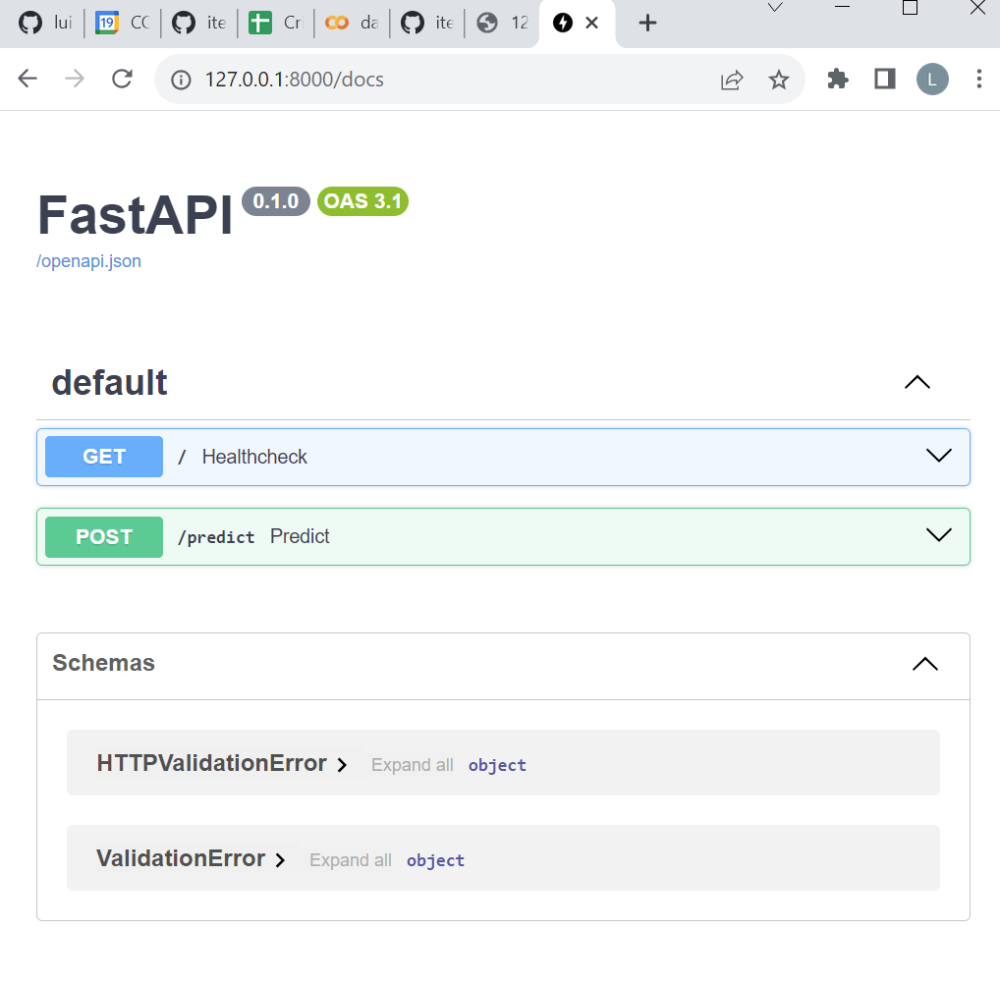

# ITESM MLOPS Project - Luis Méndez Parra A01688471

# PASSENGER SATISFACTION PREDICTION MODEL

## Introduction

This is the final project, where we delve into the core aspects of ML frameworks and their real-world application. Throughout this undertaking, we'll put into practice fundamental tools and concepts essential for crafting software within the MLOps realm. This journey encompasses not only environment setup but also optimal practices for conceiving ML models and deploying them.

## About the project

Our mission with this project is to architect a sturdy and reproducible MLOps workflow for the development, training, and deployment of machine learning models. We'll begin with a random forest model as a proof of concept due to its straightforward nature. This model will be applied to the Airline Passenger Satisfaction dataset ( https://www.kaggle.com/datasets/teejmahal20/airline-passenger-satisfaction ) to predict the level satisfaction of a passenger's airline based on specific attributes.

The project encompasses the following key areas:

1. **Key concepts of ML systems**  
In this segment, we lay the foundation for MLOps by providing insights into the lifecycle and architecture of ML systems.

2. **Basic concepts and tools for software development**  
This module is dedicated to introducing the fundamental principles of software development that serve as the base of MLOps.

3. **Development of ML models**  
Here, we see the creation of an ML model. Starting from experimentation in notebooks, we delve into code refinement and ultimately culminate in the creation of an API to serve the model.

4. **Deployment of ML models**  
The objective of this module is to show how a model is served as a web service to make predictions.

5. **Integration of concepts**  
The final module is a fusion of all the wisdom gathered in previous sections. Witness the integration in action as we present a demonstration of Continuous Delivery in practice.

### Baseline

Lead the orchestration of a comprehensive workflow. This encompasses everything from honing data to unveiling a local web service, all centered around harnessing the predictive prowess of a supervised model. Our info is the Satisfaction Passanger Airline dataset, and we try to get insights into the passengers' satisfaction during his journey on the airline.

### Scope 

The project has the purpose to attend the problem of get the satisfaction level of a customer from an airline through analytical solutions like ML models. Once the model has been developed the final step is to construct an API REST to consume the model without expose the source code of the model.

Note:This project is planned to cover the topics seen in the course syllabus, which was designed to include technical capacity levels 0, 1 and a small part of 2 of [Machine Learning operations maturity model - Azure Architecture Center | Microsoft Learn](https://learn.microsoft.com/en-us/azure/architecture/example-scenario/mlops/mlops-maturity-model).


### Links to experiment in notebooks

You can try to explore this notebooks to find different analytics solutions.

* 1. [data-visualization-and-ml-for-psg-satisfaction](Docs/data-visualization-and-ml-for-psg-satisfaction.ipynb)
* 2. [airline-passenger-satisfaction-eda-ml](Docs/airline-passenger-satisfaction-eda-ml.ipynb)
* 3. [passengerssatisfaction-outlierdetection-97-recall](Docs/passengerssatisfaction-outlierdetection-97-recall.ipynb)

## Setup

Firstable is importante to change the name luis.mendez defined in the path :
"C:\Users\luis.mendez\luigicode\..." to the user name of your local computer in the tests.py file and app.py file.

### Python version and packages to install

Note: Change the directoy to the root folerd.

We need to create a virtual environment with Python 3.10.

    ```
    python -m venv venv
    ```

After that we need to activate with the following command:

    ```
    venv\Scripts\activate
    ```

After we need to install libraries we neeed to run the following command to install the libraries/packages.

    ```
    pip install -r requirements.txt  
    ```

[requirements](requirements.txt)

## Model training from a main file

To train the Random Forest Model, only run the following code:

```
python luigicode/main.py
```

The link of the file is this: [main.py](main.py) 

The model was saved in  ./models/random_forest_output.pkl

## Execution of unit tests

You can find a folder called tests in the root directory where the following tests have been defined:
[Tests folder](tests)

* Test `test_missing_indicator_transform`:  
Test the `transform` method of the MissingIndicator transformer.

* Test `test_missing_indicator_fit`:  
Test the `fit` method of the MissingIndicator transformer.

* Test `test_csv_file_existence`:  
Test case to check if the CSV file exists.

* Test `test_model_existence`:  
Test to validate the existence of a `.pkl` model file.


### Execution instructions

Test to try Data Retriever Class defined in the load folder in load_data.py

The following test validates the [load_data.py](itesm_mlops_project/load/load_data.py) module, with the `DataRetriever` class.

Follow the next steps to run the test.

* Run in the terminal:

    ```bash
    pytest ./tests/tests.py::test_csv_file_existence -v
    ```

* You should see the following data output:


    ```pytest
    ================================================= test session starts =================================================
platform win32 -- Python 3.10.9, pytest-7.4.0, pluggy-1.2.0 -- C:\Users\luis.mendez\luigicode\venv\Scripts\python.exe
cachedir: .pytest_cache
rootdir: C:\Users\luis.mendez\luigicode
plugins: anyio-3.7.1
collected 1 item

tests/tests.py::test_csv_file_existence PASSED                                                                   [100%]

================================================= 1 passed in 10.38s ==================================================
    ```


And Also you can try all the test with the same procedure only you need to change the name of the test you want to try in the command:


    ```
    pytest ./tests/tests.py::name_of_tests -v
    ```

The tests are: test_missing_indicator_transform , test_missing_indicator_fit, test_model_existence

## Usage 

### Individual Fastapi and Use Deployment

To display the API we need to run the next command:

uvicorn api.app:app --reload


    ```
    uvicorn api.app:app --reload
    ```
#### Checking endpoints

To check the endpoints we need to:

1. Access `http://127.0.0.1:8000/`, you will see a message like this `"Titanic is all ready to go!"`
2. Access `http://127.0.0.1:8000/docs`, the browser will display something like this:



3. Try running the next predictions with the endpoint wirting the following values:

    * **Prediction 1**  
        Request body

        ```bash
        {
        "Gender": 1,
        "Age": 1,
        "xx": 0
        }
        ```

        Response body
        The output will be:

        ```bash
        "Resultado predicción: [0]"
        ```

Note: This is only an example the features depend from the predictors choosen when you train your model.

### Individual deployment of the API with Docker and usage

#### Build the image

* Ensure you are in the `luigicode/` directory (root folder) and check that Docker is running
* Run the following code to build the image:


    ```bash
    docker build -t api-image -f C:\Users\luis.mendez\luigicode\app\Dockerfile C:\Users\luis.mendez\luigicode\app
    ```

Note: Change the path where you have located the Dockerfile

The output will be this:

```bash
    C:\Users\luis.mendez\luigicode>docker build -t api-image -f C:\Users\luis.mendez\luigicode\app\Dockerfile C:\Users\luis.mendez\luigicode\app
[+] Building 44.5s (12/12) FINISHED                                                                                                     docker:default
 => [internal] load build definition from Dockerfile                                                                                              0.0s
 => => transferring dockerfile: 642B                                                                                                              0.0s
 => [internal] load .dockerignore                                                                                                                 0.0s
 => => transferring context: 2B                                                                                                                   0.0s
 => [internal] load metadata for docker.io/library/python:3.11-slim                                                                               5.5s
 => [1/7] FROM docker.io/library/python:3.11-slim@sha256:17d62d681d9ecef20aae6c6605e9cf83b0ba3dc247013e2f43e1b5a045ad4901                         8.4s
 => => resolve docker.io/library/python:3.11-slim@sha256:17d62d681d9ecef20aae6c6605e9cf83b0ba3dc247013e2f43e1b5a045ad4901                         0.0s
 => => sha256:17d62d681d9ecef20aae6c6605e9cf83b0ba3dc247013e2f43e1b5a045ad4901 1.65kB / 1.65kB                                                    0.0s
 => => sha256:0275089b5b654bb33931fc239a447db9fdd1628bc9d1482788754785d6d9e464 1.37kB / 1.37kB                                                    0.0s
 => => sha256:596e0d6b34dfaa7ed330941075bcd38b376b3eba8e5b63a1da38bf04fe08bdd3 6.92kB / 6.92kB                                                    0.0s
 => => sha256:52d2b7f179e32b4cbd579ee3c4958027988f9a8274850ab0c7c24661e3adaac5 29.12MB / 29.12MB                                                  5.5s
 => => sha256:2b8a9a2240c1224b34f6aafbc3310f9a3fe65bd6893050906d02e89fc8326aa9 3.50MB / 3.50MB                                                    1.4s
 => => sha256:051d6521462a7eb4ca0374e97701d6eec68eb51b118d3ef5d002798b498fb12e 17.86MB / 17.86MB                                                  3.5s
 => => sha256:fce84b1f897c621e9474bd4d5a49e2e22fa35e248e78e754010d34ec3d2d28cd 245B / 245B                                                        1.6s
 => => sha256:46233543d8c2dc599bdb9d522180ca9e14cad4ac2017a5dc481660bfa4aa3ed9 3.38MB / 3.38MB                                                    2.6s
 => => extracting sha256:52d2b7f179e32b4cbd579ee3c4958027988f9a8274850ab0c7c24661e3adaac5                                                         1.3s
 => => extracting sha256:2b8a9a2240c1224b34f6aafbc3310f9a3fe65bd6893050906d02e89fc8326aa9                                                         0.1s
 => => extracting sha256:051d6521462a7eb4ca0374e97701d6eec68eb51b118d3ef5d002798b498fb12e                                                         1.0s
 => => extracting sha256:fce84b1f897c621e9474bd4d5a49e2e22fa35e248e78e754010d34ec3d2d28cd                                                         0.0s
 => => extracting sha256:46233543d8c2dc599bdb9d522180ca9e14cad4ac2017a5dc481660bfa4aa3ed9                                                         0.3s
 => [internal] load build context                                                                                                                 0.7s
 => => transferring context: 88.65MB                                                                                                              0.7s
 => [2/7] WORKDIR /app                                                                                                                            0.2s
 => [3/7] COPY . .                                                                                                                                0.1s
 => [4/7] RUN pip3 install --no-cache-dir -r requirements.txt                                                                                    19.6s
 => [5/7] COPY . .                                                                                                                                0.1s
 => [6/7] RUN pip3 install --no-cache-dir -r requirements.txt                                                                                     1.5s
 => [7/7] RUN apt-get update && apt-get install -y vim                                                                                            7.5s
 => exporting to image                                                                                                                            1.5s
 => => exporting layers                                                                                                                           1.5s
 => => writing image sha256:300f530e3aea21ec1186240dc74cb74ab77f923c42fffca7a3abb6e8dc400b54                                                      0.0s
 => => naming to docker.io/library/api-image                                                                                                      0.0s

What's Next?
  View summary of image vulnerabilities and recommendations → docker scout quickview
```

* Inspect the image created by running this command:

    ```bash
    docker images
    ```

    Output:

    ```bash
    REPOSITORY   TAG       IMAGE ID       CREATED         SIZE
    api-image    latest    300f530e3aea   3 minutes ago   672MB
    ```

#### Run  REST API

1. Run the next command to start the `api-image` image in a container.

    ```bash
    docker run -d --rm --name api-c -p 8000:8000 api-image
    ```
This will be the output:

    ```bash
    C:\Users\luis.mendez\luigicode>docker run -d --rm --name api-c -p 8000:8000 api-image
    224a672913bbefa4679dec60495b4337bc451b847c40883754228a042df28630
    ```

2. Check the container running.

Run the following command:

    ```bash
    docker ps -a
    ```

    This will be the Output:

    ```bash
    C:\Users\luis.mendez\luigicode>docker ps -a
    CONTAINER ID   IMAGE       COMMAND                  CREATED              STATUS              PORTS                    NAMES
    224a672913bb   api-image   "uvicorn app:app --h…"   About a minute ago   Up About a minute   0.0.0.0:8000->8000/tcp   api-c

    ```


#### Checking endpoints for app

1. Access `http://127.0.0.1:8000/`, and you will see a message like this `Passenger satisfaction predictor is ready to go!`
2. A file called `main_api.log` will be created automatically inside the container. We will inspect it below.
3. Access `http://127.0.0.1:8000/docs`, the browser will display something like this:
    )

4. Try running the following predictions with the endpoint by writing the following values:
    * * **Prediction 1**  
        Request body

        ```bash
        {
        "Gender": 1,
        "Age": 1,
        "xx": 0
        }
        ```

        Response body
        The output will be:

        ```bash
        "Resultado predicción: [0]"
        ```

#### Opening the logs

1. Run the command

    ```bash
    docker exec -it api-c bash
    ```

    Output:

    ```bash
    root@224a672913bb:/app# 
    ```

2. Check the existing files:

    ```bash
    ls
    ```

    Output:

    ```bash
    Dockerfile  README_DOCKERFILE.md  __pycache__  app.py  ml_models  models  predictor  requirements.txt
    root@224a672913bb:/app#
    ```
3. Open the file `main_api.log` and inspect the logs with this command:

    ```bash
    vim main_api.log
    ```


4. Copy the logs to the root folder:

    ```bash
    docker cp api-c:/main_api.log .
    ```
#### Delete container and image

* Stop the container:

    ```bash
    docker stop api-c
    ```

* Verify it was deleted

    ```bash
    docker ps -a
    ```

    Output:

    ```bash
    CONTAINER ID   IMAGE     COMMAND   CREATED   STATUS    PORTS     NAMES
    ```

* Delete the image

    ```bash
    docker rmi api-image
    ```

    Output:

    ```bash
    Deleted: sha256:bb48551cf5423bad83617ad54a8194501aebbc8f3ebb767de62862100d4e7fd2
    ```
### Complete deployment of all containers with Docker Compose and usage

#### Create the network

First, create the network AIService by running this command:

```bash
docker network create AIservice
```

#### Run Docker 

*  Ensure you are in the directory where the docker-compose.yml file is located. In this case is the root folder.

* Now run the next command to start the App and Frontend APIs

    ```bash
    docker-compose -f C:\Users\luis.mendez\luigicode\docker-compose.yml up --build
    ```

    You will see something like this:

    ```bash
    [+] Running 2/2
    ✔ Container luigicode-app-1 Created                                                                                         0.1s
     ✔ Container luigicode-frontend-1  Created
    ```


#### Checking endpoints in Frontend

1. Access `http://127.0.0.1:3000/`, and you will see a message like this `"Front-end is all ready to go!"`
2. A file called `frontend.log` will be created automatically inside the container. We will inspect it below.
3. Access `http://127.0.0.1:3000/docs`, the browser will display something like this:
    

4. Try running the following predictions with the endpoint `classify` by writing the following values:
    * **Prediction 1**  
        Request body

        ```bash
        {
        "Gender": 1,
        "Age": 1,
        "xx": 0
        }
        ```

        Response body
        The output will be:

        ```bash
        "Resultado predicción: [0]"
        ```

### Opening the logs in Frontend

Open a new terminal, and execute the following commands:

1. Copy the `frontend` logs to the root folder:

    ```bash
    docker cp luigicode-frontend-1:/frontend.log .
    ```

    Output:

    ```bash
    Successfully copied 3.12kB to .../luigicode/.
    ```

2. You can inspect the logs 

#### Opening the logs in App

Open a new terminal, and execute the following commands:

1. Copy the `app` logs to the root folder:

    ```bash
    docker cp luigicode-app-1:/main_api.log .
    ```

    Output:

    ```bash
    Successfully copied 2.56kB to .../luigicode/.
    ```

2. You can inspect the logs 

### Delete the containers with Docker Compose

1. Stop the containers that have previously been launched with `docker-compose up`.

    ```bash
    docker-compose -f luigicode/docker-compose.yml stop 
    ```

    Output:

    ```bash
    [+] Stopping 2/2
    ✔ Container luigicode-frontend-1  Stopped                           0.3s 
    ✔ Container luigicode-app-1       Stopped                           0.4s 
    ```

2. Delete the containers stopped from the stage.

    ```bash
    docker-compose -f luigicode/docker-compose.yml rm
    ```

    Output:

    ```bash
    ? Going to remove luigicode-frontend-1, luigicode-app-1 Yes
    [+] Removing 2/0
    ✔ Container luigicode-app-1       Removed                           0.0s 
    ✔ Container luigicode-frontend-1  Removed                           0.0s 
    ```

## Resources

Here you will find information about this project and more.

## Information sources:

https://github.com/luismeparra/luigicode.git

### Contact Information

*  **Credits**

a01688471@tec.mx Luis Méndez 

* **Contributors**